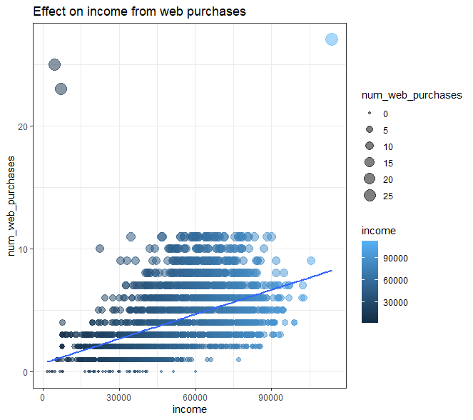

# Marketing Analytics


Analysis of marketing data for some random company.

## Tech Stack


## Download

```bash
  git clone https://github.com/Onnamission/Marketing-Analytics.git
```

## About Dataset

The dateset is referred from kaggle which provides information of its marketing of food.

## Problems in Current Solutions

 - No reason was given of why to get unique values of every column.
 - No reason was given on what basis they selected 2 parameters for comparasion or analysis.
 - Pie chart was used for many number of factors.
 - No trend analysis was shown.
 - Classification was done but for what?
 - No proper visualization.
 - No proper usage of chi-square test for independence.

## My Approach

 - Cleaned the dataset.
 - Applied normalization.
 - Applied Chi-square test to get independent and dependent variables.
 - Applied correlation.
 - Appied linear regression for trend analysis.
 - Clean analytics through dashboard.

### Step 1 - Data Cleaning

Removed the NAs and special characters.

### Step 2 - Normalization

Normalized the data between the range of 1000 to 2000 because applying chi-square test on the samll and factorized values like 0 and 1, the chi-square test is not applicable as it generates the warning plus all the parameters should be at the same range for correct and genuine calculation.

### Step 3 - Chi-Square Test

This test is applied to check which parameter should be dependent and which should be independent when compared.

For this, a single score is generated by substrating the observed value from the expected value and from the list of those substrated values, mean was calculated.


### Step 4 - Correlation

Correaltion was applied to check which paramters should be taken into consideration when getting trend analysis or during linear regression. It helps to compare only those parameters which makes logic and that we are not comparing 2 illogical parameters.

As I have considered the pivoted dataset, the number of columns were 39 and so the correlation was so huge and it can't clearly show correlation scores and labels.

So, I output it in the csv file, made a dataframe and got the graph for some labels like correlation between income and all the given parameters. 


On the similar manner, you can do it with all other parameters.

But just for the occcasion, I have made the graph for first five parameters.


### Step 5 - Linear Regression

Implemented linear regression for trend analysis between two parameters by referring to its chi-square test and correlation score.

The one with less difference between the observed value and expected value is taken as independent variable and one with high difference is taken as dependent variable. The variable with good (not highest) correlation value with all the other variables is considered for linear regression.

Like correlation between Income and 3 other parameters - num_web_vists_months, num_web_purchases, num_store_purchases, the one with good (and obviously positive values) correlation value is taken into consideration.

For the above scenario, correlation between income and num_web_vists_months and num_web_purchases is good.





The r-squared value was below 0.5 for all three, so can't say that above results are true. If you want to increase the value of r-squared, optimization can be performed. Refer to [Repo](https://github.com/Onnamission/Sales-Regression-Analysis) for optimization.

### Step 6 - Dashboard

The dashboard is made using tableau. This one only shows people analytics for now. For customer analytics, check [customer analytics](https://github.com/Onnamission/Customer-Segment-Analysis).


### Difference between people analytics and customer analytics

 - **People Analytics:** Gives the overview of people in the market. The people mentioned is not necessarily company's customers.

 - **Customer Analytics:** Gives the analysis of company's customers behaviour towrds their products.

## 🔗 Links
[](https://public.tableau.com/app/profile/aditya.kakde)

## Acknowledgements

 - [Dataset](https://www.kaggle.com/datasets/jackdaoud/marketing-data?select=ifood_df.csv)
